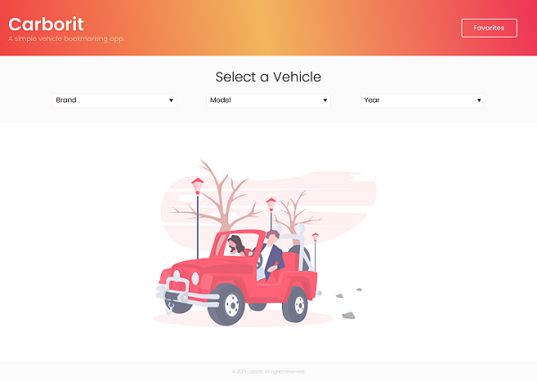

# Carborit

### A simple vehicle bookmarking app.




Carborit is a simple vehicle bookmarking app that uses [Fipe API](http://deividfortuna.github.io/fipe) for fetching brand, model and year to show informantion about the selected vehicle.

## Browsers support

| Edge | Firefox | Chrome |
| ---- | ------- | ------ |
| 16+  | 52+     | 57+    |

## Features

A few things that you can do with Carborit:

- Filter vehicles by its brand, model and year
- Add, remove and list your favorited vehicles

## Development

### Clone Code

```bash
git clone https://github.com/takebo/carborit.git
```

### Install Dependencies

```bash
cd carborit
npm install
```

### Dev Mode

```bash
npm start
```

### Build Release

```bash
npm build
```

After building, the application will be found in the project's `public` directory.

## Technology Stack

- [React](https://github.com/facebook/react)
- [Create React App](https://github.com/facebook/create-react-app)
- [Axios](https://github.com/axios/axios)
- [Sass](https://github.com/sass/node-sass)

## Todo

- [x] Filters (Brand, Model, Year)
- [x] Favorites
- [x] Responsive Design
- [ ] Unit Testing

## Credits and references

- The vector placeholder for empty vehicle and empty favorites is provided by [unDraw](https://undraw.co/), created by [Katerina Limpitsouni](https://twitter.com/ninalimpi).
